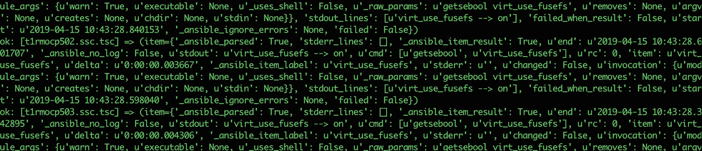

<h1 align="center">Hi 👋, I'm Sergii</h1>
<h3 align="center">DevOps Engineer</h3>

<ul>
	<li>🔭 I'm looking for the opportunity to constantly develop</li>
	<li>📄 I'm working on my <a href="https://github.com/b-c-v/CI-CD-Project" target="_blank" rel="noreferrer">CI/CD project</a></li>
	<li>
<ul>
<h3 align="left">My current certificates include:</h3>

<h3 align="left">Languages and Tools:</h3>

